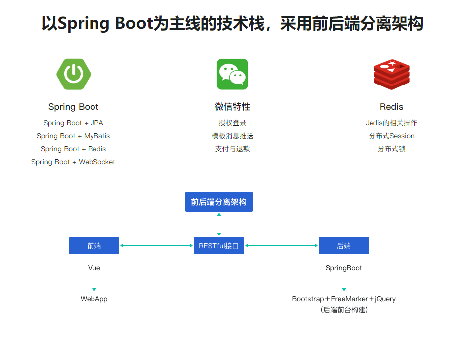

# elm / 饿了么（伪） 🍔 😋

## 项目介绍

`elm-delivery` 项目是一套微信点餐系统

* 买家端包含了商品、评论、 商家介绍、订单、支付模块。

* 卖家端包含了类目增删、商品上下架、订单模块。

## 技术栈

* 前端 -- 尚未开发

JS + Node.js + Vue.js

* 后端

SpringBoot +  JPA + MyBatis + Redis + WebSocket + SpringCloud

## 组织结构

前端

后端

微服务化

## 参考资料

* [2019更新版 Spring Boot双版本(1.5/2.1) 
打造企业级微信点餐系统](https://coding.imooc.com/class/117.html)
* [Spring Cloud微服务实战](https://coding.imooc.com/class/187.html)
* [Vue.js 2.5 + cube-ui 重构饿了么 App](https://coding.imooc.com/class/74.html)
